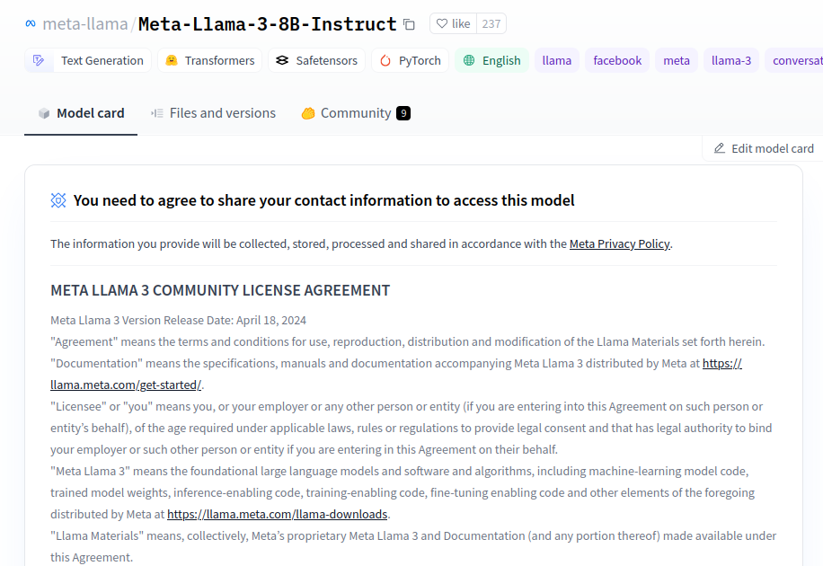
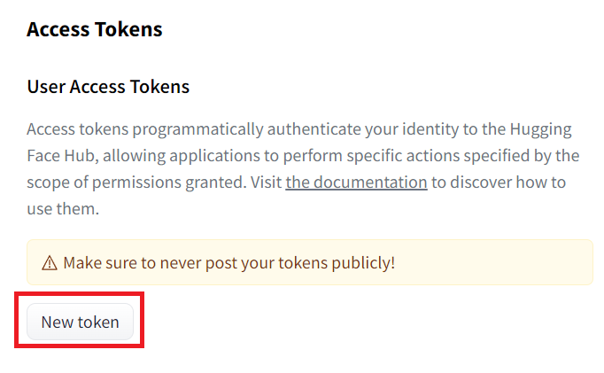
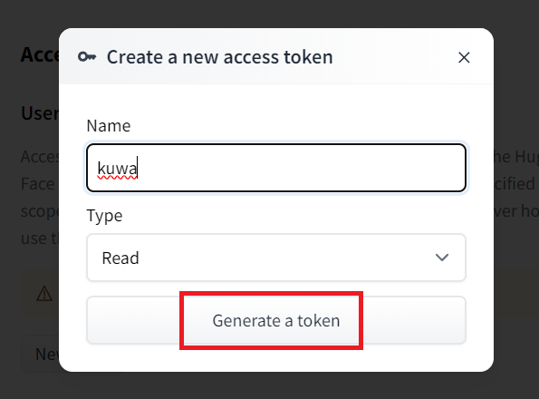
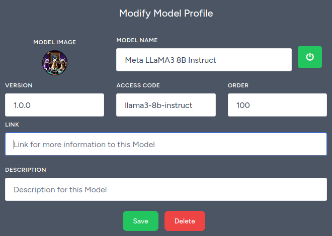
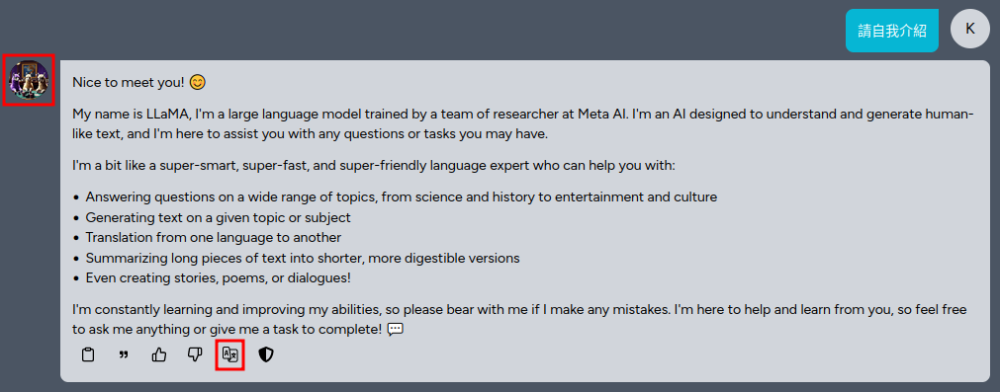
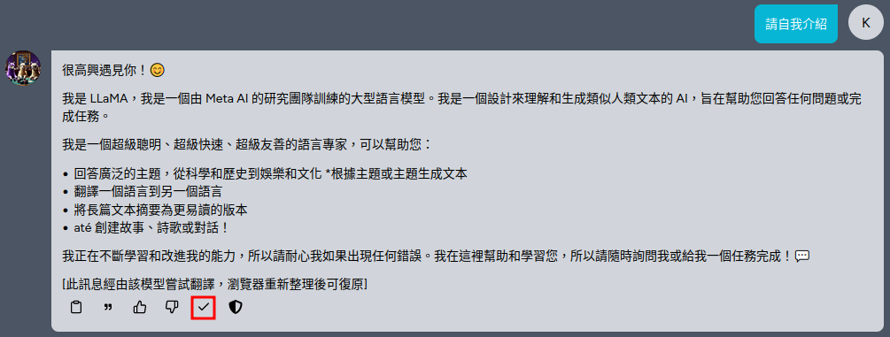
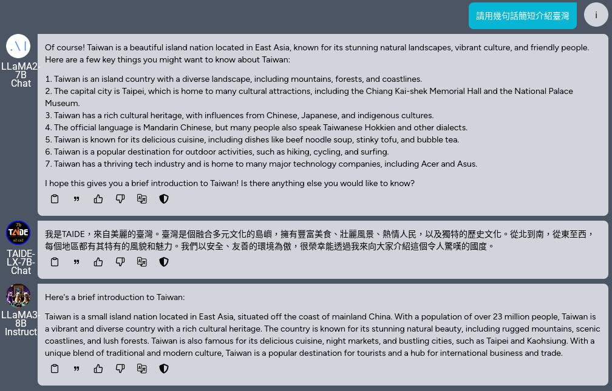

## Getting the Model

### Method 1: Applying for Access on HuggingFace

1. Log in to HuggingFace and apply for access to the meta-llama/Meta-Llama-3-8B-Instruct model (approximately 1 hour review time)
   
2. If you see the "You have been granted access to this model" message, you have obtained the model access, and you can download the model
   

<!-- truncate -->

3. If you need to use a model that requires login, you need to set up a HuggingFace token. If you are using a model that does not require login, you can skip this step
    Go to https://huggingface.co/settings/tokens?new_token=true  
     
    Enter your desired name  
     
    Then, keep this token safe (do not share it with anyone)  
   

### Method 2: Direct Download from HuggingFace

- If you don't want to log in to HuggingFace, you can find a third-party re-uploaded model (named Meta-Llama-3-8B-Instruct, no GGUF): 
    HuggingFace search: https://huggingface.co/models?search=Meta-Llama-3-8B-Instruct  
    For example, NousResearch/Meta-Llama-3-8B-Instruct, remember the name  
   

## 2. Kuwa Settings

### Method 1: Starting Executor using Command

1. You can start the Llama3 8B Instruct Executor (with code `llama3-8b-instruct`) using the following command, replacing `<YOUR_HF_TOKEN>` with the HuggingFace token obtained in the previous step. If you downloaded it from a third-party, leave it blank.

    The `--model_path` parameter is followed by the name of the model on the Huggingface hub. You can obtain the model using method 1: `meta-llama/Meta-Llama-3-8B-Instruct` or method 2: `NousResearch/Meta-Llama-3-8B-Instruct`.

    ```sh
    export HUGGING_FACE_HUB_TOKEN=<YOUR_HF_TOKEN>
    kuwa-executor huggingface --access_code llama3-8b-instruct --log debug --model_path meta-llama/Meta-Llama-3-8B-Instruct --stop " --no_system_prompt
    ```

    ```sh
    export HUGGING_FACE_HUB_TOKEN=
    kuwa-executor huggingface --access_code llama3-8b-instruct --log debug --model_path NousResearch/Meta-Llama-3-8B-Instruct --stop " --no_system_prompt
    ```

2. After adding the Llama3 8B Instruct model settings in the web frontend, you can use it.
    

### Method 2: Starting Executor using Docker

1. Create a `llama3.yaml` file in the `genai-os/docker/` directory and fill in the following content. If you use method 1, you need to modify the `command` parameter in the compose file to `meta-llama/Meta-Llama-3-8B-Instruct`.
```yaml
services:
  llama3-executor:
    build:
      context: ../
      dockerfile: docker/executor/Dockerfile
    image: kuwa-executor
    environment:
      EXECUTOR_TYPE: huggingface
      EXECUTOR_ACCESS_CODE: llama3-8b-instruct
      EXECUTOR_NAME: Meta Llama3 8B Instruct
      # HUGGING_FACE_HUB_TOKEN: ${HUGGING_FACE_HUB_TOKEN}
    depends_on:
      - kernel
      - multi-chat
    command: ["--model_path", "NousResearch/Meta-Llama-3-8B-Instruct", "--no_system_prompt", "--stop", "<|eot_id|>"]
    restart: unless-stopped
    volumes: ["~/.cache/huggingface:/root/.cache/huggingface"]
    deploy:
      resources:
        reservations:
          devices:
          - driver: nvidia
            device_ids: ['0']
            capabilities: [gpu]
    networks: ["backend"]
```

2. Use the following command to start a new container (`<...>` is the existing system's compose file combination, and the existing system does not need to be stopped).

```sh
sudo docker compose -f compose.yaml <...> -f llama3.yaml up --build
```

3. If the Executor runs successfully, you will see the following image.
    

## 3. Kuwa Usage

1. Wait for the model to download and then log in to Kuwa. You can start chatting with Llama3.
2. Llama3 is set to prefer English, and you can use the "Translate this model's response" function to translate the model's response into Chinese.
      
      
3. You can use the group chat function to compare the responses of Llama3, Llama2, and TAIDE-LX-7B-Chat.
      