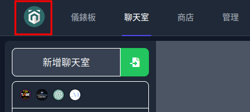
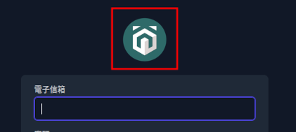
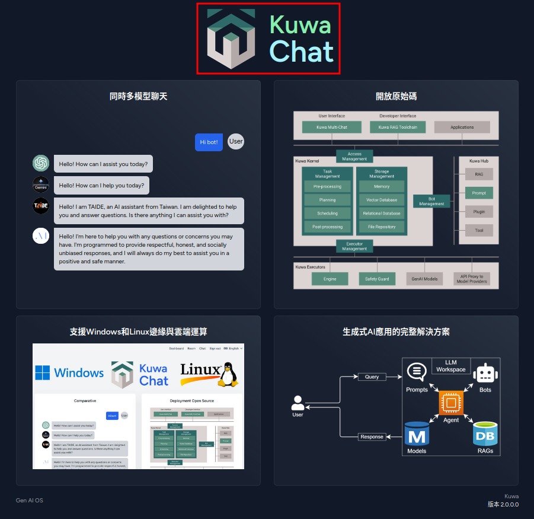
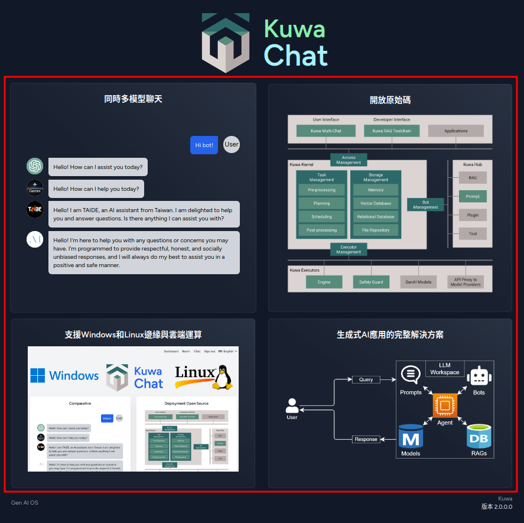

# Configuration

Kuwa GenAI OS is divided into the front-end Multi-chat WebUI, the back-end Kuwa Kernel, and Kuwa Executors. This document records the setup methods for each component.

## Multi-chat WebUI
### Configuration File

The main configuration file for Multi-chat is located at `.env` in `multi-chat/`. You can refer to `.env.dev` in `multi-chat/` to adjust the settings to meet your needs.

```
APP_NAME="Kuwa Chat"  # The name of the entire website, which will be applied to the website Title, email name, etc.
APP_ENV=production    # Use "local" during development, change to "production" when officially launched
APP_KEY=              # The secret key for Cookies and Sessions, which is automatically generated by the installer and does not need to be set manually
APP_DEBUG=false       # Whether to print debug messages
APP_URL=http://127.0.0.1/ # The publicly accessible URL for the website
API_Key=              # The secret key used for internal API calls, which is automatically generated by the installer and does not need to be set manually

Email_Required=true   # Whether to require email when logging in, usually it's best to keep it true unless you need to rewrite the login authentication method

# Log settings
# For more information, see: https://laravel.com/docs/10.x/logging
LOG_CHANNEL=stack
LOG_DEPRECATIONS_CHANNEL=null
LOG_LEVEL=debug

# Database settings
# For more information, see: https://laravel.com/docs/10.x/database
DB_CONNECTION=sqlite
# DB_HOST=
# DB_PORT=
# DB_DATABASE=
# DB_USERNAME=
# DB_PASSWORD=

# Email sending settings, used to send verification emails for forgotten passwords
# For more information, see: https://laravel.com/docs/10.x/mail
MAIL_MAILER=smtp
MAIL_HOST=smtp.gmail.com
MAIL_PORT=465
MAIL_USERNAME=
MAIL_PASSWORD=
MAIL_ENCRYPTION=tls
MAIL_FROM_ADDRESS="YOUR MAIL HERE"
MAIL_FROM_NAME="${APP_NAME}"

# Service queue settings, used to store service requests sent to the backend
# For more information, see: https://laravel.com/docs/10.x/redis
REDIS_HOST=127.0.0.1
REDIS_PASSWORD=null
REDIS_PORT=6379

# LDAP settings, used to connect to other permission management systems
# For more information, see: https://ldaprecord.com/docs/laravel/v3/configuration/#using-an-environment-file-env
LDAP_LOGGING=false
LDAP_CONNECTION=default
LDAP_HOST=
LDAP_USERNAME="uid=root,cn=users,dc=test,dc=com"
LDAP_PASSWORD=
LDAP_PORT=389
LDAP_BASE_DN="dc=test,dc=com"
LDAP_TIMEOUT=5
LDAP_SSL=false
LDAP_TLS=false
LDAP_SASL=false

INFORMATION_URL='https://kuwaai.tw/' # Displayed in "More Information" in the menu bar, allowing users to enter quickly
# ALLOWED_IPS=    # Restrict the source IP addresses that can access the website, you can fill in multiple CIDRs separated by commas, including IPv4 and IPv6
# ALLOWED_EMAIL=  # Restrict the email endings that can be used during registration, use commas to separate. For example, nuk.edu.tw, then mail.nuk.edu.tw, nuk.edu.tw, etc. can be registered
# DEFAULT_GROUP=  # The default group invitation code, if no invitation code is filled in or the invitation code does not exist, the group corresponding to this invitation code will be joined

# Supported languages that can be switched on the website, filled in JSON format
# For example, '{"en_us":"English","zh_tw":"Chinese (Taiwan)"}' can limit the language switch to English and Chinese
# en_us and zh_tw are the language file names under multi-chat\lang
# LANGUAGES='{"en_us":"English","zh_tw":"Chinese (Taiwan)","zh_cn":"Chinese(China)","ja_jp":"Japanese (Japan)","de":"Deutsch (Deutschland)","cs_cz":"Čeština (Česká republika)","fr_fr":"Français (France)","ko_kr":"한국어 (대한민국)"}'
locale=en_us          # Default language, if it is en_us, the default language is English, and if it is zh_tw, the default language is Chinese
fallback_locale=en_us # To which language should the translation fallback when the language file is missing
```

### Customized Components
Multi-chat supports customized UI components. You can create your own UI components under `multi-chat/resources/views/components/custom/` to replace the default components with the same name under `components/`.

Currently, it supports customization of the main logo of the application, the homepage and the large logo of the maintenance page, the main content of the homepage, the footer content of the homepage, etc.

#### Main Logo of the Application
- Component name: `application-logo.blade.php`





#### Large Logo of the Homepage and Maintenance Page
- Component name: `logo.blade.php`  



#### Main Content of the Homepage
- Component name: `welcome_body.blade.php`



#### Footer Content of the Homepage
- Component name: `welcome_footer.blade.php`


## Kuwa Kernel
Currently, the main configuration file for the Kernel is located under `genai-os/kernel/src/variable.py`.

```
version = "v1.0"    # Kuwa Kernel version, do not modify
data = {}           # Internal data, do not modify
log_folder = "logs" # Log directory
record_file = "records.pickle" # The permanent storage location for the internal data of Kuwa Kernel, used to retain data when restarting the Kernel

port = 9000     # The connection port that the Kernel listens to
ip = "0.0.0.0"  # The IP address that the Kernel listens to

# The following are the related settings for the safety filter (SafetyGuard) function
os.environ['SAFETY_GUARD_MANAGER_URL'] = 'http://localhost:8000'    # Manager component address
os.environ['SAFETY_GUARD_DETECTOR_URL'] = 'grpc://localhost:50051'  # Detector component address
safety_guard_update_interval_sec = 30 # Filter list update interval
```

## Kuwa Executors
Please refer to the setup instructions in GitHub
- [Setup Guide in Chinese](https://github.com/kuwaai/genai-os/blob/main/src/executor/README_TW.md)
- [Setup Guide in English](https://github.com/kuwaai/genai-os/tree/main/src/executor#readme)
