v0.3.0 added SearchQA, leveraging Google search to provide solutions for organizational QnA.   
This article will provide you steps on how to implement SearchQA.

## Google API Key Application
> [!WARNING] 
> Google search API currently has a daily free quota of 100 times, please use it with caution

1. Go to [Google Programmable Search Engine Create Page](https://programmablesearchengine.google.com/controlpanel/create) and fill in the following information to create a custom search engine  
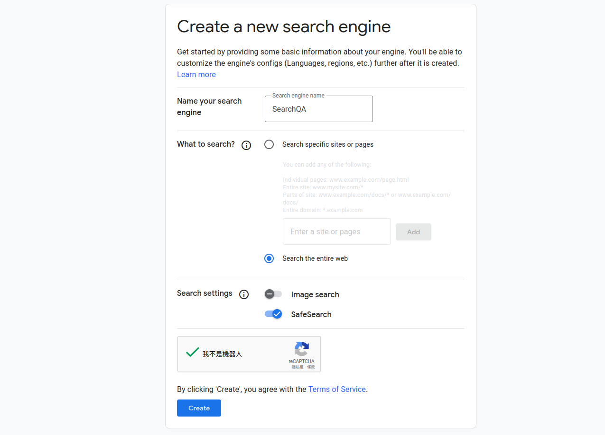

<!-- truncate -->

2. Click "Customize" after creating a new search engine to copy the CSE ID (Custom Search Engine ID) and API key  
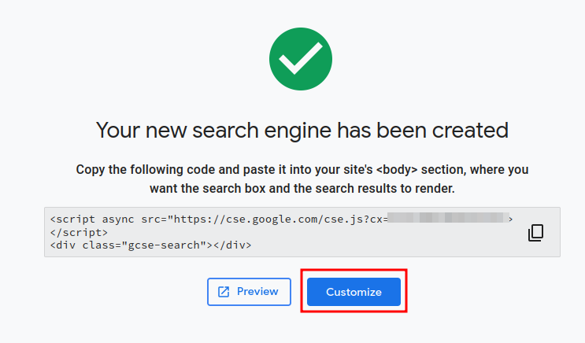

3. The Search engine ID can be found under the Overview section, remember this ID, and use CSE ID to represent it later  
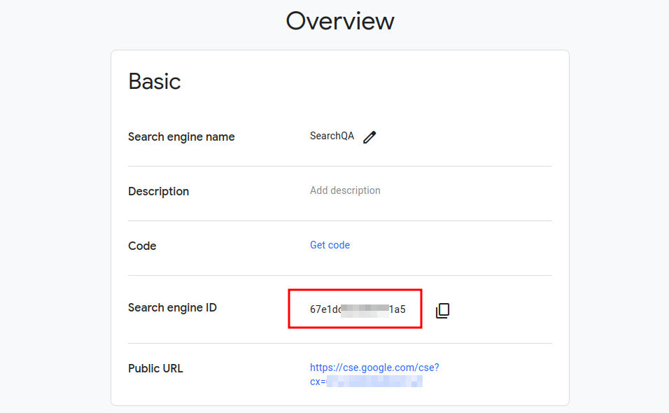

4. Scroll down the page and go to [Custom Search JSON API](https://developers.google.com/custom-search/v1/introduction)  
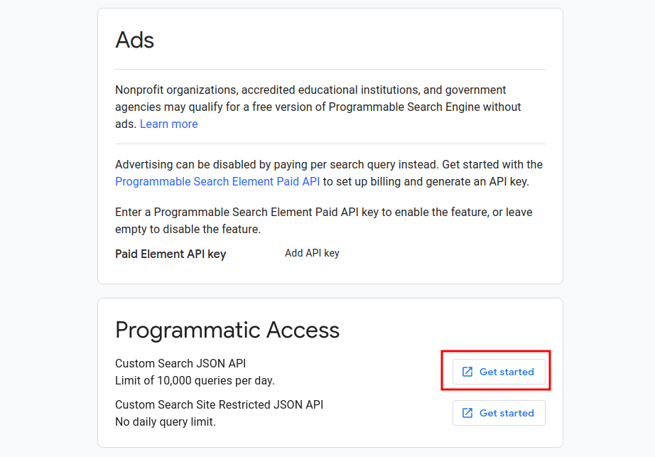

5. Click the "Get a Key" button to get the API key  
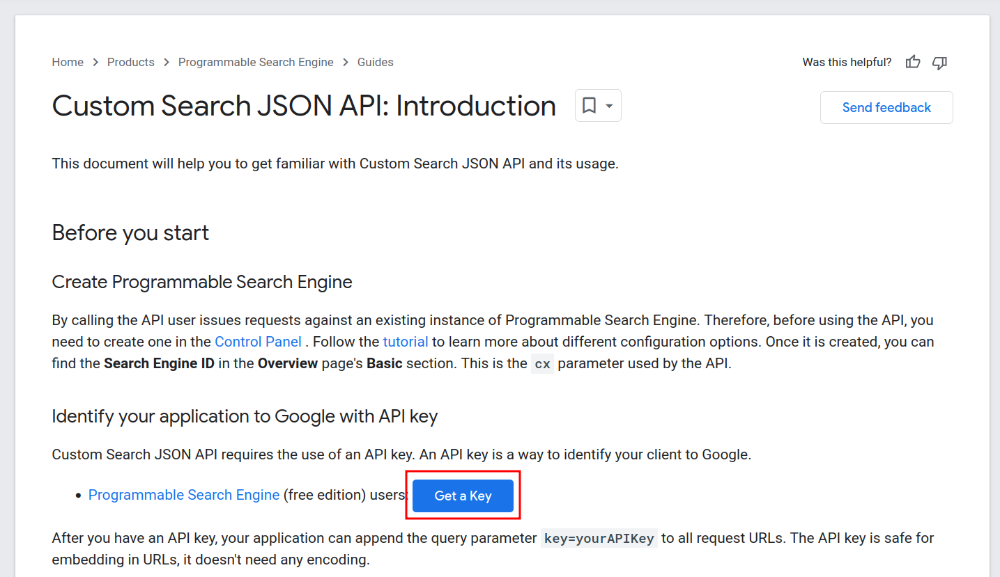

6. You can use an existing Google cloud project or create a new one  
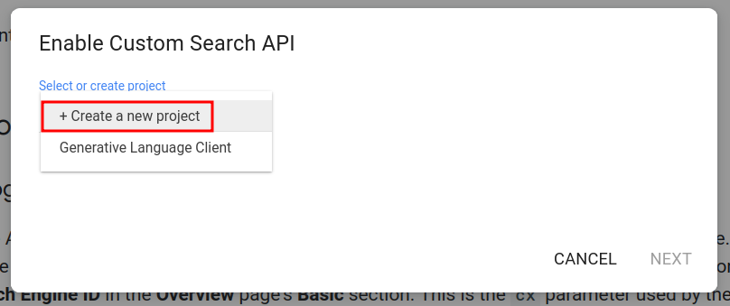  
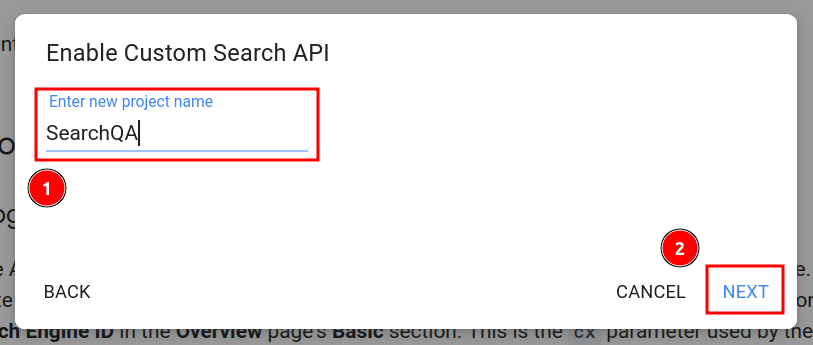  

7. Click SHOW KEY to display the API key, remember this key, it will be used later  
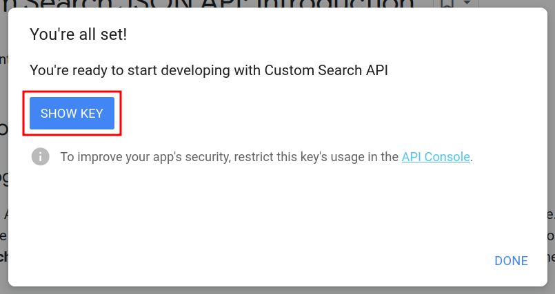  
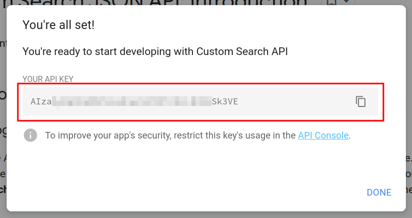  

## Windows Tutorial
1. Execute `C:\kuwa\GenAI OS\windows\executors\SearchQA\init.bat`, fill in the API key and CSE ID you just applied for,  
   If you want to limit the search results to certain domains, you can fill in `restricted sites`; if there are multiple domains, please separate them with a semicolon (;)  
   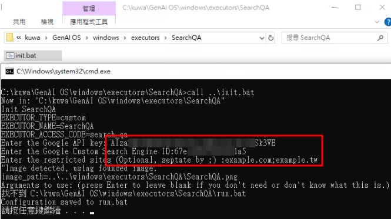  

2. Restart Kuwa, or go back to the command line of Kuwa GenAI OS, enter the command "reload" to reload all Executors  
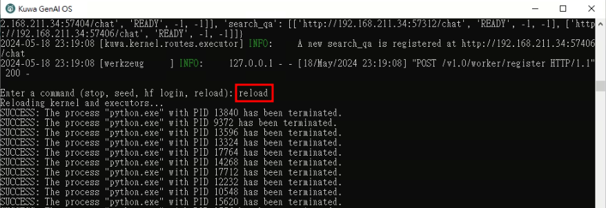  

3. You can see SearchQA after reloading, which can be used to answer questions based on information on the Internet  
  
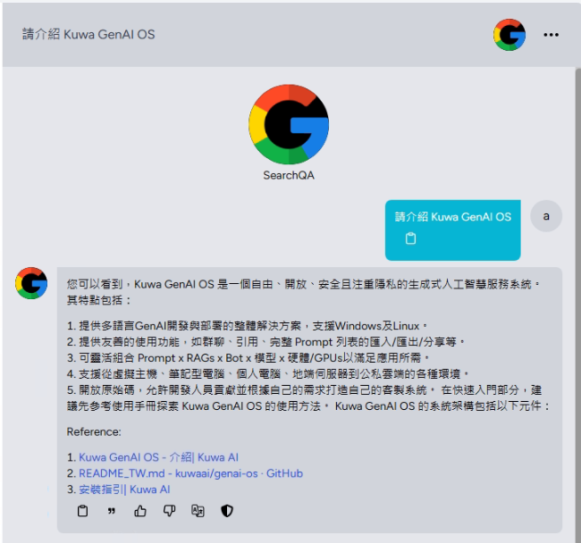  


## Docker Tutorial
1. Please refer to `docker/compose/searchqa.yaml` to create the SearchQA Executor.  
   Replace `<YOUR_GOOGLE_API_KEY>` and `<YOUR_GOOGLE_CUSTOM_SEARCH_ENGINE_ID>` with the API key and CSE ID applied in the previous stage,  
   `EXECUTOR_NAME` can be changed to an easy-to-remember name.  
   `--restricted_sites` can restrict search results to certain domains; if there are multiple domains, please separate them with semicolons (;).  
   The `--model` parameter can be used to specify a model to answer. If the `--model` parameter is omitted, the first Executor online in the Kernel (excluding Executors with "-qa" prefixes or suffixes) will be used to answer.

   ```yaml
   services:
     searchqa-executor:
       build:
         context: ../../
         dockerfile: docker/executor/Dockerfile
       image: kuwa-executor
       environment:
         CUSTOM_EXECUTOR_PATH: ./docqa/searchqa.py
         EXECUTOR_ACCESS_CODE: search-qa
         EXECUTOR_NAME: SearchQA
       depends_on:
         - kernel
         - multi-chat
       command: [
         "--api_base_url", "http://web/",
         "--model", "geminipro",
         "--google_api_key", "<YOUR_GOOGLE_API_KEY>",
         "--google_cse_id", "<YOUR_GOOGLE_CUSTOM_SEARCH_ENGINE_ID>",
         #"--restricted_sites", "example.tw;example.com"
         ]
       extra_hosts:
         - "localhost:host-gateway"
       restart: unless-stopped
       networks: ["backend", "frontend"]
   ```
2. Add `searchqa` to the `confs` array of `docker/run.sh` and then re-execute `docker/run.sh` to start the SearchQA Executor