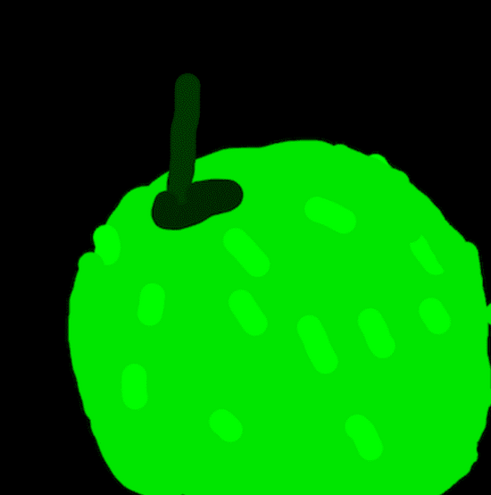
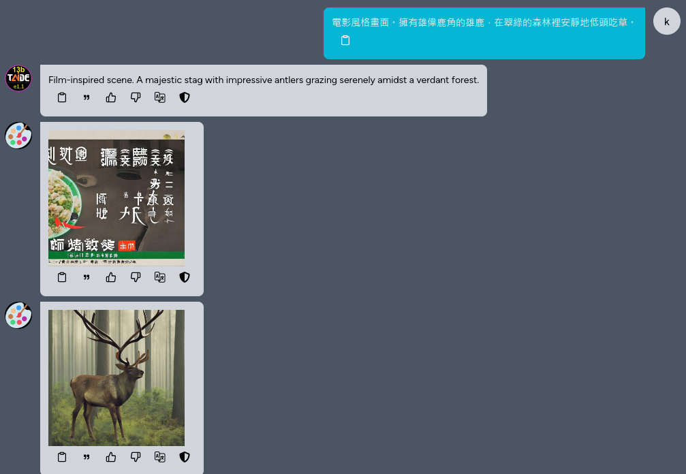
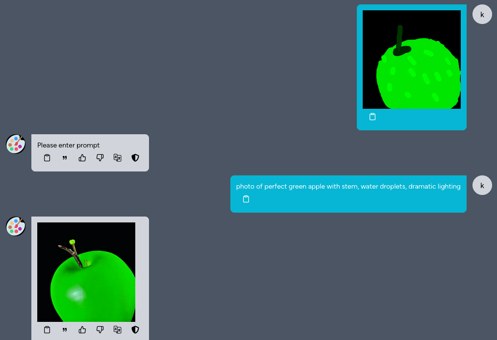

Kuwa v0.3.1 adds Kuwa Painter based on the Stable Diffusion image generation model,  
You can generate an image by inputting a text, or upload an image and generate an image with a text.

<!-- truncate -->

## Known issues and limitations
### Hardware requirements

The default model uses stable-diffusion-2, and the VRAM consumed when running on GPU is as shown in the following table.

| Model Name|VRAM requirement|
|------|-------|
| stable-diffusion-2            | ~3GB |
| stable-diffusion-xl-base-1.0  | ~8GB |
| sdxl-turbo                    | ~8GB |
| stable-diffusion-3-medium-diffusers | ~18 GB |

### Known limitations
- sdxl-turbo throws an error while performing img2img

## Build Painter Executor

### Windows version startup steps

The Windows version should automatically execute Painter Executor by default. If it is not executed, please follow the steps below:
1. Double-click `C:\kuwa\GenAI OS\windows\executors\painter\init.bat` to generate related execution settings
2. Restart Kuwa, or reload the Executor by inputting `reload` in the terminal window of Kuwa
3. An Executor named Painter should be added to your Kuwa system

### Docker version startup steps

The Docker compose configuration file for Kuwa Speech Recognizer is located in `docker/compose/painter.yaml`. You can refer to the following steps to start it:
1. Add `"painter"` to the confs array in `docker/run.sh` (copy from run.sh.sample if the file does not exist)
2. Execute `docker/run.sh up --build --remove-orphans --force-recreate`
3. An Executor named Painter should be added to your Kuwa system

## Using Painter

### Text to Image

You can input a text and let Kuwa Painter generate an image for you. It is important to note that the original Stable Diffusion model has a poor understanding of Chinese.  
At this time, you can use the group chat and quoting functions of Kuwa to let other language models translate the user's Prompt first, and then ask the Stable Diffusion model to generate an image, which usually gives better results.  
The first generated image in the figure below is based on the original Chinese User prompt (`電影風格畫面。擁有雄偉鹿角的雄鹿，在翠綠的森林裡安靜地低頭吃草。`), and the second image is the Prompt translated by TAIDE (`Film-inspired scene. A majestic stag with impressive antlers grazing serenely amidst a verdant forest.`) was used as the input to Stable Diffusion, and the quality difference between the two images is significant.



### Image to Image

You can also upload a sketch, and then describe what you want to draw, and Kuwa Painter will draw it for you.



### Complete configuration instructions

Kuwa Painter can adjust generation parameters through the Modelfile in the front-end Store. Commonly adjustable parameters are as follows

```dockerfile
PARAMETER model_name stabilityai/stable-diffusion-xl-base-1.0
PARAMETER imgen_num_inference_steps 40 # The number of denoising steps. More denoising steps usually lead to a higher quality image at the expense of slower inference
PARAMETER imgen_negative_prompt "" #The prompt or prompts to guide what to not include in image generation. If not defined, you need to pass negative_prompt_embeds instead. Ignored when not using guidance (guidance_scale < 1).
PARAMETER imgen_strength 0.5 #Indicates extent to transform the reference image. Must be between 0 and 1. image is used as a starting point and more noise is added the higher the strength. The number of denoising steps depends on the amount of noise initially added. When strength is 1, added noise is maximum and the denoising process runs for the full number of iterations specified in num_inference_steps. A value of 1 essentially ignores image.
PARAMETER imgen_guidance_scale 0.0 #A higher guidance scale value encourages the model to generate images closely linked to the text prompt at the expense of lower image quality. Guidance scale is enabled when guidance_scale 
PARAMETER imgen_denoising_end 0.8 # What % of steps to be run on each experts (80/20) (SDXL only)
```

In addition, Kuwa Painter can also be set through dynamic command line parameters. The parameters that can be set are as follows

```
Model Options:
  --model MODEL         The name of the stable diffusion model to use. (default: stabilityai/stable-diffusion-2)
  --n_cache N_CACHE     How many models to cache. (default: 3)

Display Options:
  --show_progress       Whether to show the progress of generation. (default: False)
```

For more information, please refer to [genai-os/src/executor/image_generation/README.md](https://github.com/kuwaai/genai-os/blob/main/src/executor/image_generation/README.md)