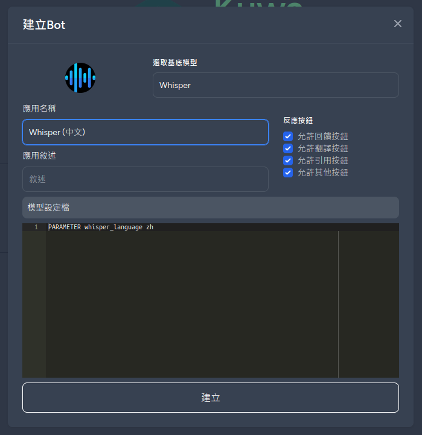
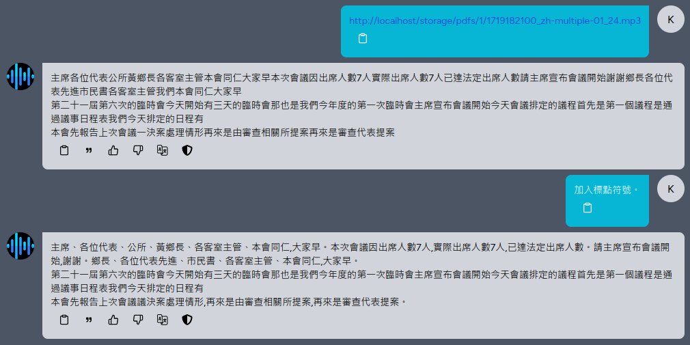
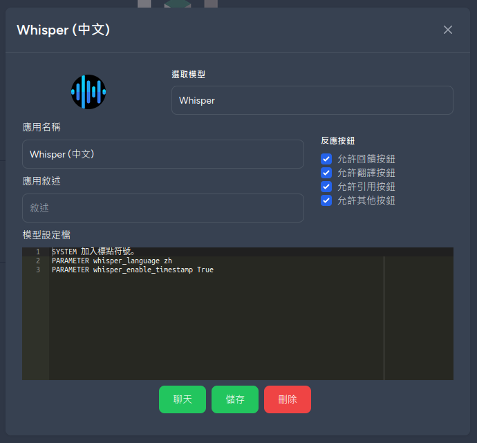
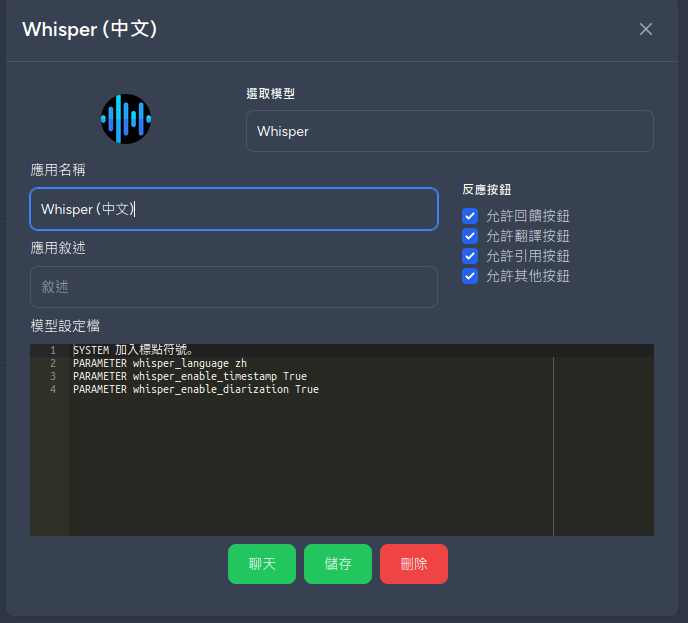
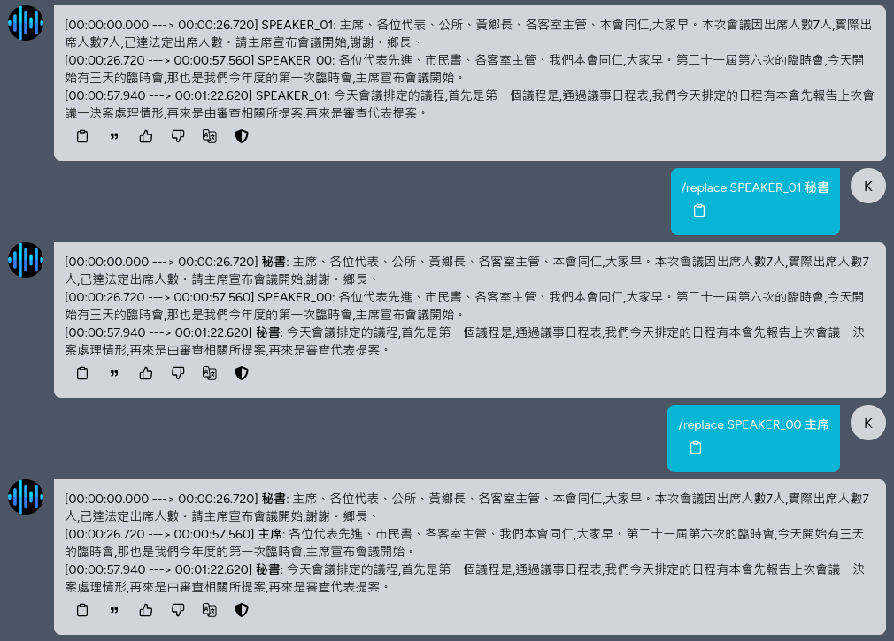

Kuwa v0.3.1 adds Kuwa Speech Recognizer based on the Whisper speech recognition model, which can generate transcripts by uploading audio files, supporting timestamps and speaker labels.

## Known Issues and Limitations
### Hardware requirements

The default Whisper medium model is used with speaker diarization disabled. The VRAM consumption on GPU is shown in the following table.

| Model Name | Number of parameters | VRAM requirement | Relative recognition speed |
|---|---|---|---|
| tiny | 39 M | ~1 GB | ~32x |
| base | 74 M | ~1 GB | ~16x |
| small | 244 M | ~2 GB | ~6x |
| medium | 769 M | ~5 GB | ~2x |
| large | 1550 M | ~10 GB | 1x |
| pyannote/speaker-diarization-3.1<br></br>(Speaker Diarization) | - | ~3GB | - |

### Known limitations

1. Currently, the input language cannot be detected automatically and must be specified manually.
2. Currently, the speaker identification module is multi-threaded, causing the model to be reloaded each time, resulting in a longer response time.
3. Content is easily misjudged when multiple speakers speak at the same time.

<!-- truncate -->

## Build Whisper Executor

### Prerequisites

If you need speaker identification, please follow the steps below to obtain the authorization for the speaker identification model:

1. Agree to the [pyannote/segmentation-3.0](https://huggingface.co/pyannote/segmentation-3.0) and [pyannote/speaker-diarization-3.1](https://hf.co/pyannote/speaker-diarization-3.1) license terms.
2. Refer to the instructions for each version to add the HuggingFace access token.
  1. [Guide for Windows](https://kuwaai.tw/blog/kuwa-os-v0.2.0-llama3-windows)
  2. [Guide for Docker](https://kuwaai.tw/blog/kuwa-os-v0.2.0-llama3-linux)

### Windows Launch Steps

The Whisper Executor should run automatically by default on Windows. If it is not running, follow these steps:
1. Double click `C:\kuwa\GenAI OS\windows\executors\download.bat` to download Whisper model. If you need speech recognition, you can also download Diarization Model at the same time.
2. Double-click `C:\kuwa\GenAI OS\windows\executors\whisper\init.bat` to generate the relevant execution settings.
3. Restart Kuwa, or type `reload` in Kuwa's terminal window to reload the Executor.
4. An Executor named Whisper should be added to your Kuwa system.

### Docker Launch Steps

The Docker compose configuration file for the Kuwa Speech Recognizer is located at `docker/compose/whisper.yaml`. You can refer to the following steps to start it:
1. Add `"whisper"` to the confs array in `docker/run.sh` (copy from run.sh.sample if the file does not exist).
2. Execute `docker/run.sh up --build --remove-orphans --force-recreate`.
3. An Executor named Whisper should be added to your Kuwa system.

## Using Whisper

### Speech to Text
You can upload an audio file to generate a transcript. The default recognition language is English.


Create a Bot and add the parameter `PARAMETER whisper_language zh` to generate transcripts in Chinese or other languages.
  
  

The Whisper model for Chinese does not output punctuation marks by default. You can influence the model's output using the User prompt or System prompt.  
  

### Transcript Timestamps
Add the parameter `PARAMETER whisper_enable_timestamp True` to the Bot configuration file to enable timestamps for the transcript.
  
  

:::info
In the above example, the user enters "." just to access the previously uploaded audio file. Remember to select the chat mode as "Continuous Q&A".
:::

### Speaker Diarization
Similarly, add the parameter `PARAMETER whisper_enable_diarization True` to the Bot configuration file to enable speaker identification and labeling.
  
  

> [!Note] 
> The command `/replace <pattern> <repl>` allows you to replace the recognition results using regular expressions. You can replace speaker names or repeatedly misidentified words.  
> The command `/speakers <n>` allows you to specify the number of speakers. The default is to detect automatically, but it may be biased. You can use this command to correct it.

### Full Configuration Description
The following parameters can be set for Bots. For a complete description, please refer to [ganai-os/src/executor/speech_recognition/README.md](https://github.com/kuwaai/genai-os/blob/main/src/executor/speech_recognition/README.md).

```dockerfile
SYSTEM "Add punctuation." #Custom vocabulary or prompting
PARAMETER whisper_model medium #Model name. Choses: large-v1, large-v2, large-v3, medium, base, small, tiny
PARAMETER whisper_enable_timestamp True #Prepend the text a timestamp
PARAMETER whisper_enable_diarization True #Label the speaker
PARAMETER whisper_diar_thold_sec 2 #Time before speakers are tagged in paragraphs that are longer than. (in seconds)
PARAMETER whisper_language en #The language of the audio
PARAMETER whisper_n_threads None #Number of threads to allocate for the inference. default to min(4, available hardware_concurrency)
PARAMETER whisper_n_max_text_ctx 16384 #max tokens to use from past text as prompt for the decoder
PARAMETER whisper_offset_ms 0 #start offset in ms
PARAMETER whisper_duration_ms 0 #audio duration to process in ms
PARAMETER whisper_translate False #whether to translate the audio to English
PARAMETER whisper_no_context False #do not use past transcription (if any) as initial prompt for the decoder
PARAMETER whisper_single_segment False #force single segment output (useful for streaming)
PARAMETER whisper_print_special False #print special tokens (e.g. <SOT>, <EOT>, <BEG>, etc.)
PARAMETER whisper_print_progress True #print progress information
PARAMETER whisper_print_realtime False #print results from within whisper.cpp (avoid it, use callback instead)
PARAMETER whisper_print_timestamps True #print timestamps for each text segment when printing realtime
PARAMETER whisper_token_timestamps False #enable token-level timestamps
PARAMETER whisper_thold_pt 0.01 #timestamp token probability threshold (~0.01)
PARAMETER whisper_thold_ptsum 0.01 #timestamp token sum probability threshold (~0.01)
PARAMETER whisper_max_len 0 #max segment length in characters
PARAMETER whisper_split_on_word False #split on word rather than on token (when used with max_len)
PARAMETER whisper_max_tokens 0 #max tokens per segment (0 = no limit)
PARAMETER whisper_speed_up False #speed-up the audio by 2x using Phase Vocoder
PARAMETER whisper_audio_ctx 0 #overwrite the audio context size (0 = use default)
PARAMETER whisper_initial_prompt None #Initial prompt, these are prepended to any existing text context from a previous call
PARAMETER whisper_prompt_tokens None #tokens to provide to the whisper decoder as initial prompt
PARAMETER whisper_prompt_n_tokens 0 #tokens to provide to the whisper decoder as initial prompt
PARAMETER whisper_suppress_blank True #common decoding parameters
PARAMETER whisper_suppress_non_speech_tokens False #common decoding parameters
PARAMETER whisper_temperature 0.0 #initial decoding temperature
PARAMETER whisper_max_initial_ts 1.0 #max_initial_ts
PARAMETER whisper_length_penalty -1.0 #length_penalty
PARAMETER whisper_temperature_inc 0.2 #temperature_inc
PARAMETER whisper_entropy_thold 2.4 #similar to OpenAI's "compression_ratio_threshold"
PARAMETER whisper_logprob_thold -1.0 #logprob_thold
PARAMETER whisper_no_speech_thold 0.6 #no_speech_thold
```