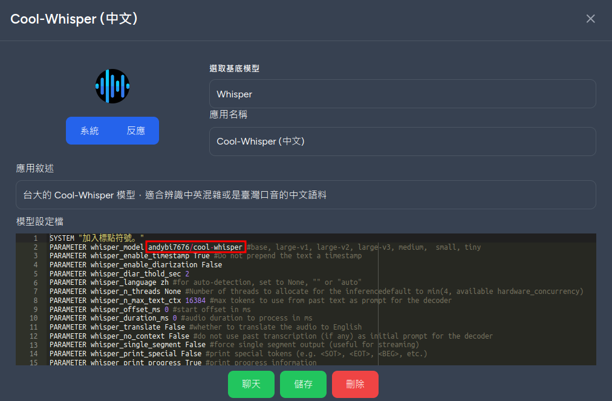

National Taiwan University's Liang-Hsuan Tseng and NTU COOL team released the Cool-Whisper model last night (7/17), which is suitable for recognizing Taiwanese pronunciation Chinese or mixed Chinese-English audio files.  
Kuwa can directly apply it by simply modifying the Modelfile.


> [!Note] 
The model was temporarily taken offline around 12:00 on 7/18 due to privacy concerns.  
Friends who want to use this model can continue to follow its [HuggingFace Hub](https://huggingface.co/andybi7676/cool-whisper) and use it once it is re-released.

## Setup Steps

1. Refer to the [Whisper setup tutorial](./2024-06-24-whisper-tutorial.md) to start the Whisper executor
    - The Cool-Whisper model is approximately 1.5 GB in size and will occupy up to 10 GB of VRAM during execution

2. Create a new bot named Cool-Whisper in the store, select Whisper as the base model, and fill in the following model settings file, focusing on the `PARAMETER whisper_model andybi7676/cool-whisper` parameter
    ```dockerfile
    SYSTEM "加入標點符號。"
    PARAMETER whisper_model andybi7676/cool-whisper #base, large-v1, large-v2, large-v3, medium,  small, tiny
    PARAMETER whisper_enable_timestamp True #Do not prepend the text a timestamp
    PARAMETER whisper_enable_diarization False
    PARAMETER whisper_diar_thold_sec 2
    PARAMETER whisper_language zh #for auto-detection, set to None, "" or "auto"
    PARAMETER whisper_n_threads None #Number of threads to allocate for the inferencedefault to min(4, available hardware_concurrency)
    PARAMETER whisper_n_max_text_ctx 16384 #max tokens to use from past text as prompt for the decoder
    PARAMETER whisper_offset_ms 0 #start offset in ms
    PARAMETER whisper_duration_ms 0 #audio duration to process in ms
    PARAMETER whisper_translate False #whether to translate the audio to English
    PARAMETER whisper_no_context False #do not use past transcription (if any) as initial prompt for the decoder
    PARAMETER whisper_single_segment False #force single segment output (useful for streaming)
    PARAMETER whisper_print_special False #print special tokens (e.g. <SOT>, <EOT>, <BEG>, etc.)
    PARAMETER whisper_print_progress True #print progress information
    PARAMETER whisper_print_realtime False #print results from within whisper.cpp (avoid it, use callback instead)
    PARAMETER whisper_print_timestamps True #print timestamps for each text segment when printing realtime
    PARAMETER whisper_token_timestamps False #enable token-level timestamps
    PARAMETER whisper_thold_pt 0.01 #timestamp token probability threshold (~0.01)
    PARAMETER whisper_thold_ptsum 0.01 #timestamp token sum probability threshold (~0.01)
    PARAMETER whisper_max_len 0 #max segment length in characters
    PARAMETER whisper_split_on_word False #split on word rather than on token (when used with max_len)
    PARAMETER whisper_max_tokens 0 #max tokens per segment (0 = no limit)
    PARAMETER whisper_speed_up False #speed-up the audio by 2x using Phase Vocoder
    PARAMETER whisper_audio_ctx 0 #overwrite the audio context size (0 = use default)
    PARAMETER whisper_initial_prompt None #Initial prompt, these are prepended to any existing text context from a previous call
    PARAMETER whisper_prompt_tokens None #tokens to provide to the whisper decoder as initial prompt
    PARAMETER whisper_prompt_n_tokens 0 #tokens to provide to the whisper decoder as initial prompt
    PARAMETER whisper_suppress_blank True #common decoding parameters
    PARAMETER whisper_suppress_non_speech_tokens False #common decoding parameters
    PARAMETER whisper_temperature 0.0 #initial decoding temperature
    PARAMETER whisper_max_initial_ts 1.0 #max_initial_ts
    PARAMETER whisper_length_penalty -1.0 #length_penalty
    PARAMETER whisper_temperature_inc 0.2 #temperature_inc
    PARAMETER whisper_entropy_thold 2.4 #similar to OpenAI's "compression_ratio_threshold"
    PARAMETER whisper_logprob_thold -1.0 #logprob_thold
    PARAMETER whisper_no_speech_thold 0.6 #no_speech_thold
    ```
   

3. You can now use the Cool-Whisper model for speech recognition. The following figure shows the use of Whisper and Cool-Whisper for recognizing mixed Chinese-English audio files, which can accurately recognize mixed Chinese-English scenarios


## References

1. [Cool-Whisper's HuggingFace Hub](https://huggingface.co/andybi7676/cool-whisper)
2. [Professor Lee's Facebook post](https://www.facebook.com/share/RJCfUwitEeQX9KNQ/?mibextid=WC7FNe)